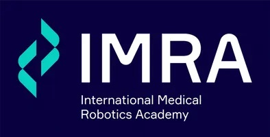

<a name="readme-top"></a>

<!-- PROJECT LOGO -->
<br />
<div align="center">
  <a href="https://github.com/mariodj0/IMRA-project">
    
  </a>

  <h1 align="center">Kidney Tumor Segmentation using nnUNet</h1>
</div>

<!-- TABLE OF CONTENTS -->
<details>
  <summary>Table of Contents</summary>
  <ol>
    <li>
      <a href="#about-the-project">About The Project</a>
      <ul>
        <li><a href="#built-with">Built With</a></li>
      </ul>
    </li>
    <li>
      <a href="#getting-started">Getting Started</a>
      <ul>
        <li><a href="#prerequisites">Prerequisites</a></li>
        <li><a href="#installation">Installation</a></li>
      </ul>
    </li>
    <li><a href="#usage">Usage</a></li>
    <li><a href="#contributors">Contributors</a></li>
    <li><a href="#acknowledgments">Acknowledgments</a></li>
  </ol>
</details>

<!-- ABOUT THE PROJECT -->
## About The Project

This project aims to automate the segmentation of kidney tumors from CT scans using the nnUNet framework, a self-configuring method for biomedical image segmentation. By accurately identifying and delineating tumor regions, we streamline the process of creating 3D printable models for surgical training and planning.

### Built With

* [![Python][python.org]][Python-url]

<p align="right">(<a href="#readme-top">back to top</a>)</p>

<!-- GETTING STARTED -->
## Getting Started

How to set up the project locally and run it.

### Prerequisites

The things you need to run the application and how to install them.

* Python 3.6+
* nnUNet framework
* MANGO software for visualization
* GPU with CUDA support for training and inference

### Installation

1. Clone the repo
   ```sh
   git clone https://github.com/mariodj0/IMRA-project.git
   ```
2. Install required Python packages
   ```sh
   pip3 install torch nnunetv2 batchgenerators
   ```

<p align="right">(<a href="#readme-top">back to top</a>)</p>

<!-- USAGE EXAMPLES -->
## Usage

Please see the `Official_Capstone_Notebook.ipynb` for a step-by-step walkthrough on how to train the model and make inferences on new data.

<!-- CONTRIBUTORS -->
## Contributors

* Aleisha Dillon: S3955398@student.rmit.edu.au
* Ei Thiri Lwin: S3866360@student.rmit.edu.au
* Frederick Amad: S3894463@student.rmit.edu.au
* Mario Kweku Djameh: S3917002@student.rmit.edu.au
* Zekiye Yildirim: S3485509@student.rmit.edu.au

Project Link: [https://github.com/mariodj0/IMRA-project](https://github.com/mariodj0/IMRA-project)

<p align="right">(<a href="#readme-top">back to top</a>)</p>

<!-- ACKNOWLEDGMENTS -->
## Acknowledgments

We would like to express our gratitude to the following supervisors for their guidance and support throughout this project:

* Dr. Ke Deng (Academic Supervisor, RMIT University)
* Andrew Costello (Industry Supervisor, IMRA Surgical)

Resources that helped us to build this project:

* [nnUNet Framework](https://github.com/MIC-DKFZ/nnUNet)
* [KiTS2023 Dataset](https://github.com/neheller/kits23)
* [MANGO Software](https://ric.uthscsa.edu/mango/)

<p align="right">(<a href="#readme-top">back to top</a>)</p>

<!-- MARKDOWN LINKS & IMAGES -->
[python.org]: https://img.shields.io/badge/python-3670A0?style=for-the-badge&logo=python&logoColor=ffdd54
[Python-url]: https://www.python.org/